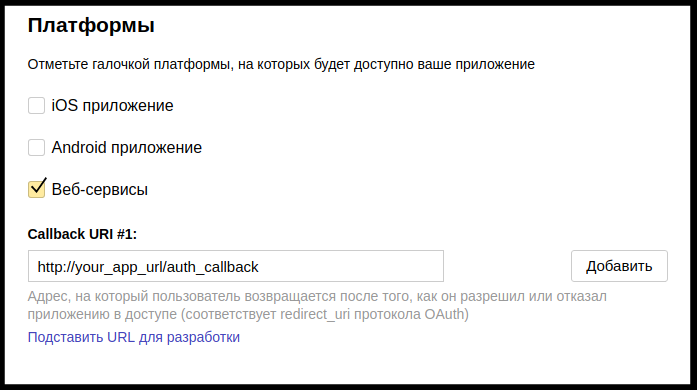
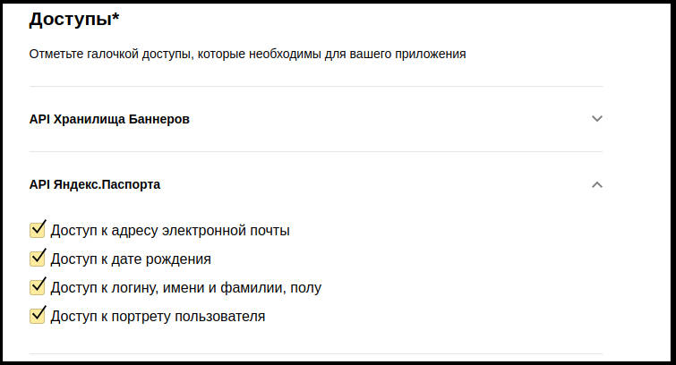
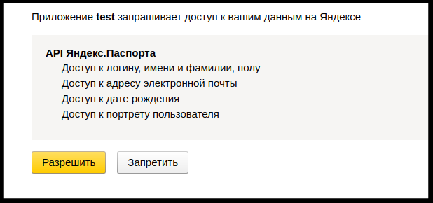

# Yandex OAuth strategy for OmniAuth

This gem contains the unofficial Yandex OAuth2 strategy for [OmniAuth](http://github.com/intridea/omniauth).

## Getting Started
### Prerequisites

This gem require [OmniAuth](http://github.com/intridea/omniauth)

But you no need add `gem 'omniauth'`.

This gem already added. 

### Installation

    gem "omniauth-yandex"
    
Register new app for sync on yandex:

1. Obtain API key for your app at Yandex [OAuth app registration page](https://oauth.yandex.ru/client/new)
2. Enter callback url for auth

3. Select service and its data for auth

### Usage

1. Add to omniauth.rb yandex provider:
    
        Rails.application.config.middleware.use OmniAuth::Builder do
            provider :yandex, ENV['YANDEX_ID'], ENV['YANDEX_PASSWORD']
        end
        
2. Add route 

        get '/auth/:provider/callback', to: 'sessions#create'
        
3. Create SessionController
###### note: This controller only as example how to create user by callback 

        class SessionsController < ApplicationController
          def create
            @user = User.find_or_create_from_auth_hash(auth_hash)
            redirect_to '/'
          end
        
          protected
        
          def auth_hash
            request.env['omniauth.auth']
          end
        end

4. Run rails server and open page

    localhost:3000/auth/yandex
    
5. Sign In yandex by own username and password
6. Take app permissions:

## Contributing

Please read [Code of Conduct](CODE-OF-CONDUCT.md) and [Contributing Guidelines](CONTRIBUTING.md) for submitting pull requests to us.

## Versioning

We use [SemVer](http://semver.org/) for versioning. For the versions available, 
see the [tags on this repository](https://github.com/evrone/omniauth-yandex/tags). 

## Changelog

The changelog is [here](CHANGELOG.md).

## Authors

* [Kir Shatrov](https://github.com/kirs) - Initial work
* [Dmitry Koropenko](https://github.com/smalew) - Maintainer

See also the list of [contributors](https://github.com/evrone/omniauth-yandex/contributors) who participated in this project.

## License

This project is licensed under the [MIT License](LICENSE).

## Acknowledgments

* http://api.yandex.ru/oauth/
